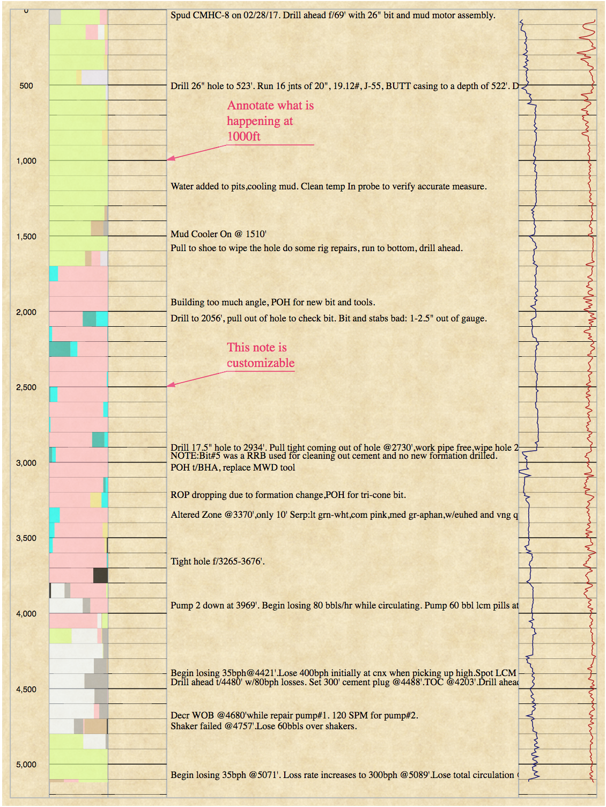

# Wellview in D3
## A Data Visualiztion Project
Wellview in D3 is a work in progress that uses data collected over monthw while drilling a geothermal well to produce electricity for municipalities in the area. The data is compiled into a graphical representation using a javascript library called D3.js.

This is a work in progress. The colorful column on the left is a lithology log that represents the rock types that were encountered while drilling the well. The The tacky colors will be replaced by rock symbols in the coming iterations.

